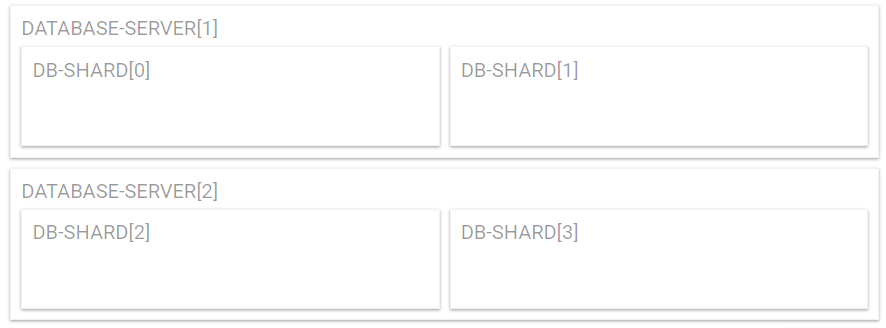

# LudicrousDB & dotenv


[LudicrousDB](https://github.com/stuttter/ludicrousdb) is a WordPress plugin, which allows splitting the database tables of a [Network](https://wordpress.org/support/article/create-a-network/) into multiple chucks (called shards) and use multiple database servers.


By default WordPress stores is database-configuration in a PHP-file called wp-config.php.

To avoid mixing code with config (like a proper [12factor-app](https://12factor.net/)) we use a separate file ([.env or dotenv](https://github.com/vlucas/phpdotenv)) to split code from configuration. This approach is used also by LEMP Stacks like [Roots Trellis](https://github.com/roots/trellis).

This repository uses an .env file to configure LudicrousDB in a simple (and quite basic) manner.

---

- ❗ This is not your default WordPress - Plugin. There are some setup-steps required.
- ❗ This is a very basic implementation. It only supports a small subset of the features LudicrousDB offers. PRs are welcome :)
- ❗ Use at your own risk. Create backups before you use this!
- ❗ Sadly [WP-CLI](https://wp-cli.org/) does not properly support sharding with LudicrousDB. It only lists tables from the first 'global' shard with `--all-tables`. When you currently `wp db export --all-tables` you only tables from your primary shard.
- ❗ Does not support replication (yet).

# Setup

1. Go ahead and get [LudicrousDB running](https://github.com/stuttter/ludicrousdb#installation).
   One of the steps there is putting a file called `db.php` into the `WP_CONTENT_DIR` ([more about WP Directories](https://codex.wordpress.org/Determining_Plugin_and_Content_Directories)) and a `db-config.php` next to your `wp-config.php` (this is all describe in the LudicrousDB ducumentation).

   - `db.php `
		- loads `mu-plugins/ludicrousdb/ludicrousdb.php`
			- loads `./includes/functions.php`
				- loads `ABSPATH` . `db-config.php`

2. Add the following to your `db-config.php`
```php

	$ludic_defaults = array(
		'host'     => DB_HOST,
		'user'     => DB_USER,
		'password' => DB_PASSWORD,
		'name'     => DB_NAME,
		'write'    => 1,
		'read'     => 1,
		'dataset'  => 'global', // default is global.
	);

	$wpdb->add_database( $ludic_defaults );

	// path to the ludicrousdb-dotenv-plugin.
	require_once WP_CONTENT_DIR . '/mu-plugins/ludicrousdb-dotenv/ludicrousdb-dotenv.php';
	$ludic_dotenv = new Ludicrousdb_Dotenv( $ludic_defaults );

```

3. Setup your .env-file (see below in examples). If you don't touch your .env everything should still be running.
4. Run wp-cli commands, to prepare all databases.

# Examples

## Example 1
We want to scale a lot. We set up some bigger amount of shards, so we can later split them.

First specify the amount of databases you want for your 'dataset' (BLOG used as example here)
```bash
# .env
# The amount of shards you want for your blogs.
DB_BLOG_COUNT = 256
# Specify details for a specific blog:

# DB_BLOG_126_USER = DB_USER <- this is automatically inherited from WP-defaults
DB_BLOG_127_USER = 'example_user' # username for the database
DB_BLOG_127_WRITE = 0
# DB_BLOG_128_USER = 'example_user' <- 'example_user' is automatically inherited from the previous entry (127)

```
Values are inherited from the previous entry (from the same 'dataset')

## Example 2
I just want to store my blogs in a different database, so they are separated from the global ones.
```bash
# .env
# give me a single shard for all blogs.
DB_BLOG_COUNT = 1
# You could specify another host. or another user.
# DB_BLOG_0_HOST = 'example_user' # username for the database
```

Now run the following wp-cli commands (on your own risk ;)
```bash
# create the databases (the default for this is spaces_development_blog_shard_0)
# you might have to use a different sql-user, who is allowed to create databases with --db_user=... --db_password=...
wp ludicrousdb_dotenv create_databases

# copy the tables to your shard(s). mysql and mysqldump have to be installed.
wp ludicrousdb_dotenv copy_tables_to_shards
```


## Note
- Things in the .env file are all uppercase, anything else is lowercase.
- In case of blog shards we use the same name for the database as for the dataset.
- Config starts form 0. So the first shard is DB_BLOG_0_... .

## Todos
- think about adding a slave to a specific blog.
- we could also move the root-blog which is difficult because wpdb->get_blog_prefix (blog_id 1 has no prefix).*
- More backend interfaces to find blogs.
- WP-CLI export is not working, as it doesn't respect custom db.php. Make a PR to WP-CLI to support sharding.
